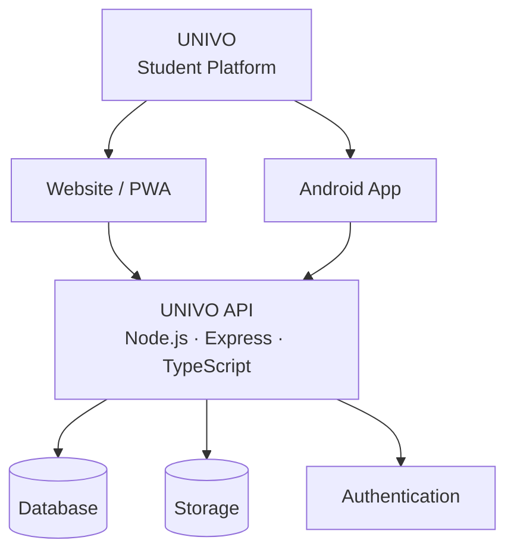

<div align="center">


<h3>A social platform built for university students in Zambia 🇿🇲</h3>


<br><br>

<a href="https://studentlife.tech">
  
</a>
<a href="https://studentlife.tech/study">
  
</a>
<a href="https://www.mediafire.com/file/tbxjofrju32lspd/UNIVO.apk/file">
  
</a>

<br><br>


<br><br>


</div>

<p align="center"></p>

## 📑 Table of Contents

- [About](#-about)
- [Vision](#-vision)
- [Features](#-features)
- [UNIVO Study AI](#-univo-study-ai)
- [Downloads & Links](#-downloads--links)
- [Technology Stack](#-technology-stack)
- [Architecture](#-architecture)
- [Getting Started](#-getting-started)
- [Building for Release](#-building-for-release)
- [Testing](#-testing)
- [Security](#-security)
- [Project Structure](#-project-structure)
- [Roadmap](#-roadmap)
- [Contributing](#-contributing)
- [Support](#-support)
- [License](#-license)

<p align="center"></p>

## 🚀 About

**UNIVO** is a student-focused social platform that brings university students together in one digital space. It combines communication, learning, community, and everyday student services into a single, connected experience.

UNIVO is built for:

| Audience | What UNIVO offers |
| --- | --- |
| 🎓 **Students** | Social feed, messaging, study tools, marketplace, housing and events |
| 👥 **Student communities** | University, course, program and club-based communities |
| 🏫 **Universities & institutions** | A space for institution-based communities and student engagement |
| 📚 **Academic learning** | Study AI, shared resources and peer help |

> **Connect • Learn • Grow.**

<p align="center"></p>

## 🌍 Vision

UNIVO aims to become one of the leading student-focused digital platforms in Zambia, and to grow beyond it over time.

The goal is not to build just another social media app. The goal is to build a **digital ecosystem around student life**.

<p align="center"></p>

The journey starts with students in Zambia 🇿🇲, with a long-term vision of expanding to students everywhere.

<p align="center"></p>

## ✨ Features

| Module | Capabilities |
| --- | --- |
| 📱 **Social Feed** | Create posts · Upload images and supported videos · Like and react · Comment and reply · Share and repost · Save posts · Edit and delete own posts · Report content · Follow students |
| 👥 **Communities** | University, course and program communities · Student groups and clubs · Community posts and discussions · Community discovery |
| 💬 **Messaging** | Private real-time conversations · Media sharing · Voice notes · Online status · Read status · Message deletion · Conversation management |
| 🤖 **Study AI** | Ask academic questions · Explain difficult concepts · Summarize information · Document and supported image analysis · Conversation history |
| 📚 **Resources** | Academic resources and books · Student materials · Document previews · Protected downloads · Resource management |
| 🏠 **Accommodation** | Student housing listings · Property photos · Listing management · Housing discovery |
| 🤝 **Roommate Finder** | Create and manage roommate listings · Browse potential roommates · Connect with other students |
| 🛒 **Marketplace** | Buy and sell between students · Product photos · Search and discovery · Pricing in Zambian Kwacha (ZMW) · Report listings |
| 📅 **Events** | Discover student events and activities · Community events · Event information |
| 🔔 **Notifications** | Messages · Reactions · Comments · Follows · Community activity · Academic reminders |
| 🎓 **Student Profiles** | Interests · Followers and following · Communities · Student discovery |
| 🆘 **Peer Help** | Help requests · Community assistance · Moderated student support |

<p align="center"></p>

## 🤖 UNIVO Study AI

<div align="center">
  
  <br><br>
  
</div>

<br>

UNIVO Study AI helps students understand academic content and study more effectively. With Study AI, students can:

- Ask academic questions and get clear explanations
- Break down difficult concepts
- Summarize notes and information
- Analyze academic documents and supported images
- Continue previous conversations or start new ones

**Try it:** [studentlife.tech/study](https://studentlife.tech/study)

<p align="center"></p>

## 📥 Downloads & Links

| Platform | Availability | Link |
| --- | --- | --- |
| 🌐 **Web** | ✅ Available | [studentlife.tech](https://studentlife.tech) |
| 📱 **Android** | ✅ Available | [Download APK](https://www.mediafire.com/file/tbxjofrju32lspd/UNIVO.apk/file) |
| 🍎 **iPhone** | 🌐 Web / PWA | [studentlife.tech](https://studentlife.tech) |
| 🏪 **Google Play** | 🔜 Coming soon | — |

| Resource | Link |
| --- | --- |
| 🤖 Study AI | [studentlife.tech/study](https://studentlife.tech/study) |
| 👨‍💻 GitHub | [Botcreationam](https://github.com/Botcreationam) |

> **Note:** Only install the Android APK from the official link above. Enable installation from unknown sources only for trusted files.

<p align="center"></p>

## 🛠️ Technology Stack

<div align="center">
  
</div>

<br>

| Layer | Technologies |
| --- | --- |
| **Frontend** | Flutter · Dart · Web technologies / PWA |
| **Backend** | Node.js · Express · TypeScript |
| **Data** | PostgreSQL database · Authentication · File storage (Supabase) |
| **Hosting** | Vercel |
| **Tooling** | Git · GitHub |

<p align="center"></p>

## 🏗️ Architecture

The web platform and the Android application share the same UNIVO backend, so user data and activity stay connected across every supported platform.



<p align="center"></p>

## ⚙️ Getting Started

### Prerequisites

- [Flutter SDK](https://docs.flutter.dev/get-started/install) (stable channel)
- Dart (bundled with Flutter)
- Android Studio or the Android SDK command-line tools
- Git

### 1. Clone the repository

```bash
git clone https://github.com/Botcreationam/UNIVO.git
cd UNIVO
```

### 2. Install dependencies

```bash
flutter pub get
```

### 3. Configure the environment

Provide the configuration values the app needs. **Only use values that are safe for a client application.**

```env
API_BASE_URL=YOUR_API_URL
SUPABASE_URL=YOUR_SUPABASE_URL
SUPABASE_ANON_KEY=YOUR_PUBLIC_ANON_KEY
```

> ⚠️ Never commit real secrets to the repository. Keep private values in environment variables or your deployment platform's secret manager.

### 4. Run the app

Verify your setup and connected devices, then launch:

```bash
flutter doctor
flutter devices
flutter run
```

<p align="center"></p>

## 📦 Building for Release

### Android APK

```bash
flutter build apk --release
```

Output: `build/app/outputs/flutter-apk/`

### Android App Bundle (Google Play)

```bash
flutter build appbundle --release
```

Output: `build/app/outputs/bundle/release/`

<p align="center"></p>

## 🧪 Testing

Run the automated tests:

```bash
flutter test
```

Before every production release, manually verify the core user flows against real backend services:

| # | Flow | # | Flow |
| --- | --- | --- | --- |
| 1 | Authentication | 8 | Resources |
| 2 | Profile | 9 | Marketplace |
| 3 | Feed | 10 | Accommodation |
| 4 | Posts | 11 | Roommate Finder |
| 5 | Communities | 12 | Events |
| 6 | Messaging | 13 | Study AI |
| 7 | Notifications | 14 | Logout |

<p align="center"></p>

## 🔐 Security

Security is a core part of UNIVO. The platform is designed around:

- Secure authentication and secure sessions
- Server-side authorization
- Protected API endpoints
- HTTPS communication
- Database access controls
- Protected file uploads and secure storage
- Input validation and rate limiting
- Protection of user information
- Production-grade environment configuration

### Handling credentials

**Never commit or expose** any of the following:

- Database passwords
- Supabase service-role keys
- JWT signing secrets
- Private API keys
- Admin passwords
- Private backend credentials
- AI provider private keys

Use environment variables and secure deployment configuration for all private values.

### Production principles

UNIVO is built on real production functionality:

```text
REAL BACKEND + REAL DATABASE + REAL AUTHENTICATION + REAL STORAGE + REAL USER FLOWS
```

Production builds must not rely on fake API responses, fake data or authentication, dead buttons, pretend uploads, local-only functionality, or exposed credentials.

### Reporting a vulnerability

If you discover a security issue, please **do not open a public issue**. Email **studentlifehelpcenter@gmail.com** with the details so it can be addressed responsibly.

<p align="center"></p>

## 📂 Project Structure

```text
UNIVO/
├── android/          # Android platform code
├── assets/           # Images, fonts and static app assets
├── lib/              # Flutter / Dart application source
├── test/             # Automated tests
├── .github/          # GitHub configuration, workflows and README assets
│   └── assets/       # Animated SVGs used by this README
├── pubspec.yaml      # Flutter dependencies and metadata
└── README.md
```

<p align="center"></p>

## 🗺️ Roadmap

### ✅ Platform (delivered)

- [x] Student social platform
- [x] Student profiles
- [x] Social feed
- [x] Communities
- [x] Messaging
- [x] Resources
- [x] Study AI
- [x] Marketplace
- [x] Accommodation
- [x] Roommate Finder
- [x] Events
- [x] Android application

### 🔄 Continuous development

- [ ] Performance improvements
- [ ] Additional Android improvements
- [ ] More student tools and services
- [ ] More university communities
- [ ] Expanded Study AI capabilities
- [ ] Google Play release
- [ ] Expansion beyond Zambia

<p align="center"></p>

## 🤝 Contributing

Contributions, suggestions and feedback are welcome. Please keep contributions focused on improving UNIVO and the student experience.

```text
Fork → Create branch → Make changes → Test → Commit → Pull request
```

1. **Fork** the repository.
2. **Create a branch** for your change: `git checkout -b feature/your-feature-name`
3. **Make your changes** and follow the existing code style.
4. **Test** your changes with `flutter test` and on a real device where possible.
5. **Commit** with a clear message: `git commit -m "feat: add your feature"`
6. **Open a pull request** describing what changed and why.

Found a bug or have an idea? [Open an issue](https://github.com/Botcreationam/UNIVO/issues).

<p align="center"></p>

## 📞 Support

| Channel | Details |
| --- | --- |
| 📧 **Email** | [studentlifehelpcenter@gmail.com](mailto:studentlifehelpcenter@gmail.com) |
| 🌐 **Website** | [studentlife.tech](https://studentlife.tech) |

If you believe in building a student platform for Zambia and beyond:

- ⭐ Star this repository
- 🐛 Report issues
- 💡 Share ideas
- 🤝 Contribute
- 📢 Help students discover UNIVO

<p align="center"></p>

## 📄 License

<!-- Add a LICENSE file to the repository and update this section, e.g. MIT, Apache-2.0, or "All rights reserved". -->

License information will be added here. Until a license is published, all rights are reserved by the project owner.

<div align="center">

<br>

**Built with ❤️ in Zambia 🇿🇲 — for students, by people who understand student life.**


<br>


</div>
